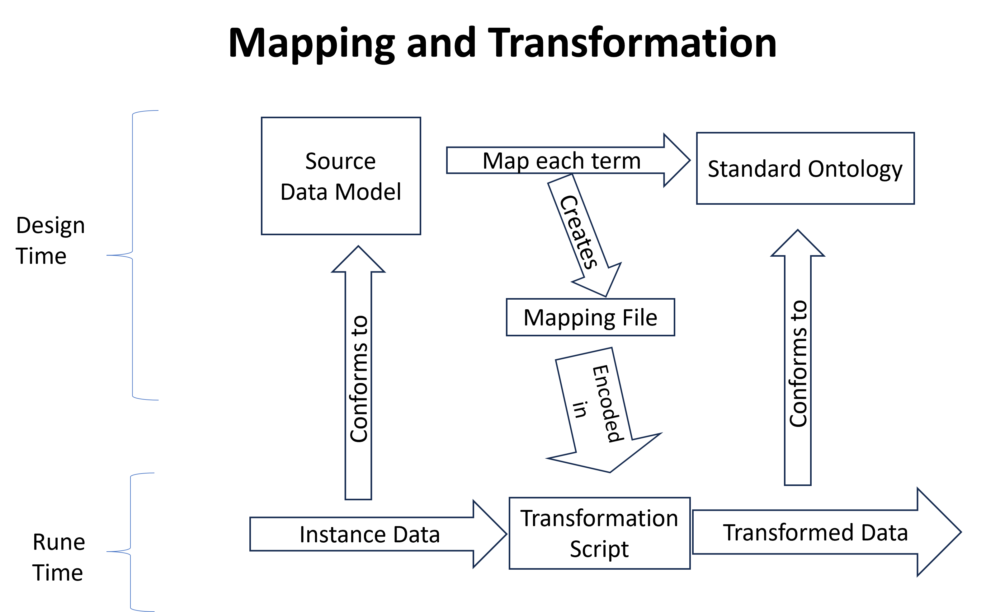

# Mapping and Transformation using PDM-Glossary (and its Ontologies)
> This is guidance on how a disparate data source is mapped to the underlying ontologies of PDM-Glossary, to enable its disparate data to be transformed into data conforming to those ontologies.  It can reversed. This will enable Data Operators to map to only one standard model to offer their users portability to any other Operator (who has also mapped to the same standard). It offers this same benefits to vendors seeking to share data with users as part of a sale, and apps that can run on this standard data.  

Note: This description and these examples have issues, which will be corrected. For example, it uses the old MyOntology, which has been replaced by IEEE P3195.1.2 Person Ontology.  

 
 

## Examples of items in Diagram above can be found:
- [Instance Data](https://github.com/I-AM-project/my-data-ontology/blob/master/dev/my-data-org-source-data.csv)
- [Mapping File](https://github.com/I-AM-project/my-data-ontology/blob/master/dev/mapping-mydata_org-mdo.csv)
- [Transformation Script](dynamicTransformationScript.py)
## How Vendors can Map their Data Models to target ontology
1. Start with your data source and data model (if available) and select the attributes of interest to your users.
2. Categorized all the attributes of the data model into a table. See example below:

    | Data Model   | Attributes              | Example Data Value |
    | ------------ | ----------------------- | ------|
    | My Navigation App | Toll Preference | Avoid Tolls |
    | My Navigation App | License Plate # | DTA 1234 |  
    | Investopedia | Full Name               | John Doe |
    | Investopedia | Social Security Number  | 123 456 7890 |
    | Investopedia | Driver’s license Number      | S1234567898765 |
    | Investopedia | Mailing address         | 21 Main St., Roosevelt Island, New York, NY, US |
    | Investopedia | Credit card Number | 2837362289292992 |
    | Investopedia | Passport Expiration Date    | 2024-08-30 |

3. Using [MyOntology](https://github.com/I-AM-project/my-data-ontology/blob/master/MyDataOntology.ttl), create an ontological representation for all the attributes in the data model. Add the represention to the table. Below is an example for the first row. 

    | Data Model Source   | Attributes | My Data Ontology Representation                                   |
    | ------------ | ---------- | ----------------------------------------------------------------- |
    | Investopedia | Full Name  | cco:Person, cco:designated_by, cco:PersonName, cco:has_value |

4. Complete the process until all the attributes have a corresponding representation. 
   
For reference, view the mydata.org [mapping](https://github.com/I-AM-project/my-data-ontology/blob/master/dev/mapping-mydata_org-mdo.csv)

##
### For more information on the Common Core Ontologies and mapping data using CCO, see [here](https://github.com/CommonCoreOntology/CommonCoreOntologies/blob/master/documentation/An%20Overview%20of%20the%20Common%20Core%20Ontologies%201.3.docx) and [here](https://github.com/CommonCoreOntology/CommonCoreOntologies/blob/master/documentation/Modeling%20Information%20with%20the%20Common%20Core%20Ontologies%201.3.docx)
